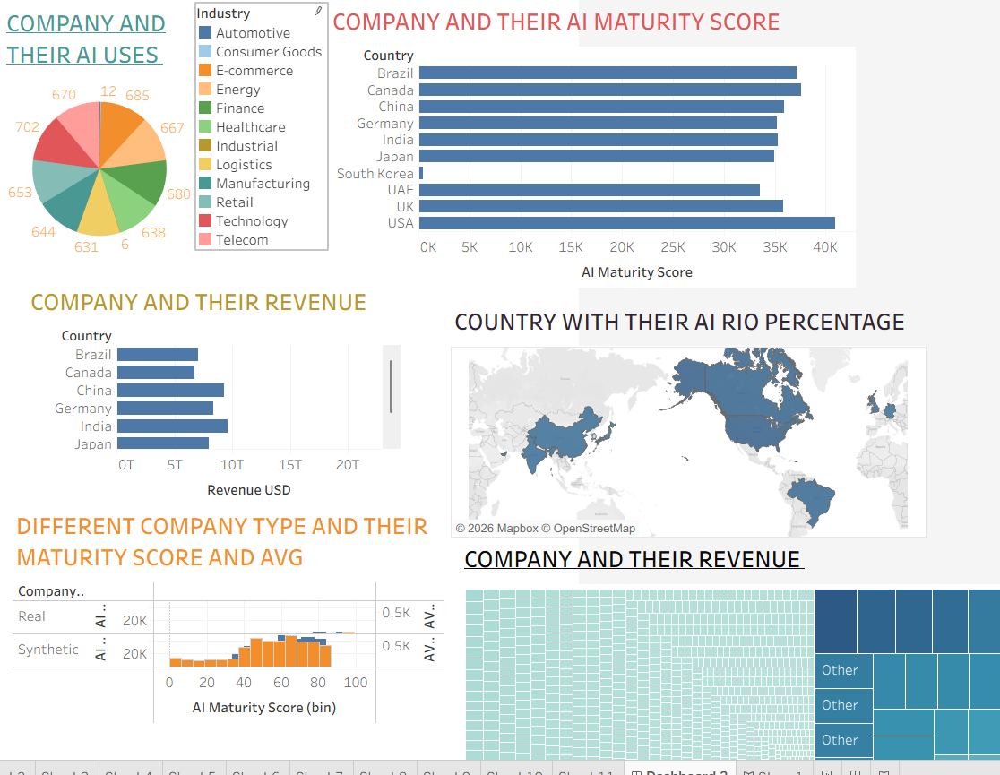
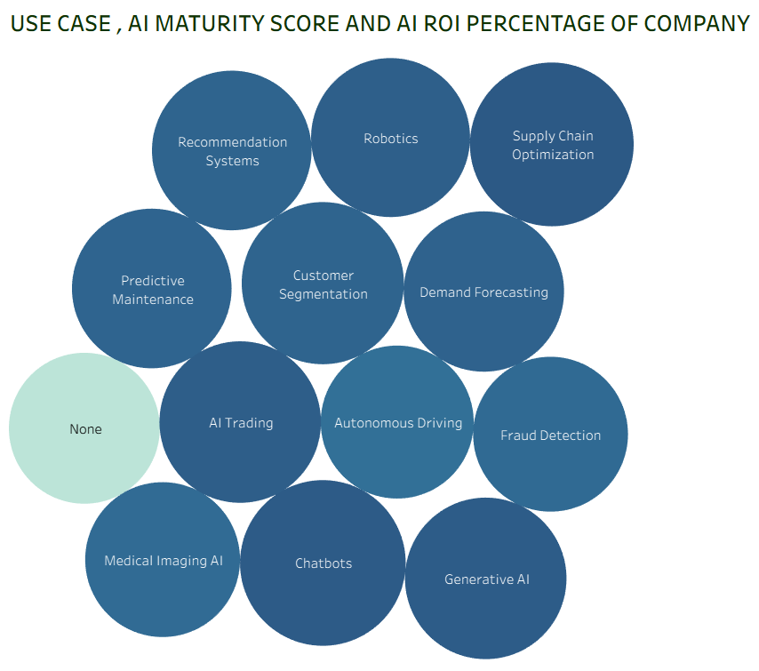
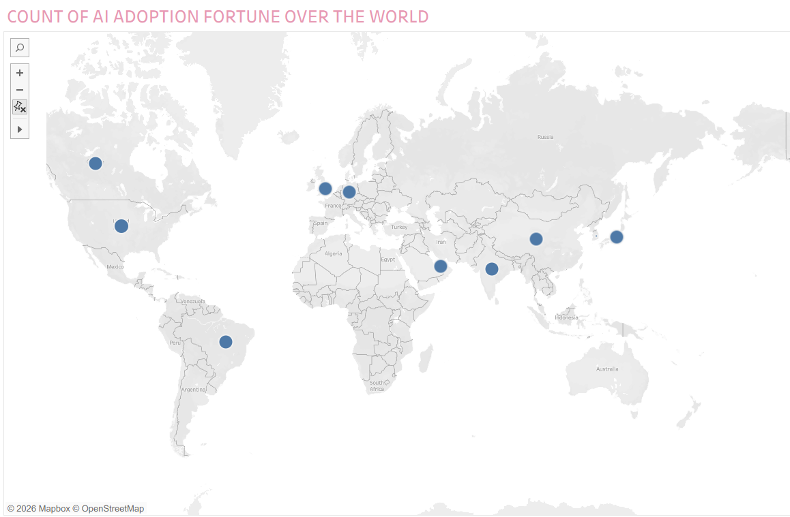

# 🌍 AI Adoption & Business Insights Dashboard

> Understanding how Artificial Intelligence is shaping companies across industries and countries.

---

##  Project Snapshot

This dashboard is a data-driven attempt to explore how organizations worldwide are adopting AI and how that reflects in their **maturity, revenue, and ROI**.

Instead of focusing only on visuals, the idea was to **extract patterns and tell a story using data**.

---

## 🎯 What this dashboard answers

* 🌐 Which countries are leading in AI maturity?
* 🏭 How does AI adoption differ across industries?
* 💰 Is there a relationship between AI maturity and revenue?
* 🤖 What are the most commonly used AI applications?

---

## 📊 Key Highlights

* Countries like **USA, UK, and Canada** show strong AI maturity presence
* Industries such as **Finance, Technology, and E-commerce** are ahead
* A noticeable trend: **higher AI maturity → stronger revenue patterns**
* Dominant use cases include:

  * Fraud Detection
  * Chatbots
  * Demand Forecasting
  * Recommendation Systems

---

## 🛠️ Tech Stack

| Category      | Tools Used                      |
| ------------- | ------------------------------- |
| Visualization | Power BI / Tableau              |
| Data Handling | Data Cleaning, Structuring      |
| Approach      | Exploratory Data Analysis (EDA) |

---

## 🖼️ Dashboard Walkthrough

### 🔹 Overview

### 🔹 AI Use Cases

### 🔹 Global AI Adoption

---

## 🧠 Thinking Behind the Project

While building this, I focused on:

* Keeping visuals **simple but informative**
* Highlighting **business-relevant insights**
* Making the dashboard usable for **decision-making perspective**

---

## 📈 Learnings

This project helped me improve:

* Translating raw data into meaningful insights
* Structuring dashboards for clarity
* Connecting technical analysis with real-world business impact

---

## 🔮 Future Scope

* Integrate a **Machine Learning model** to predict AI maturity
* Use **larger and real-time datasets**
* Add deeper filters and drill-down analysis

---

## 👨‍💻 About Me

I’m currently building my skills in **Data Science and Machine Learning**, with a focus on projects that combine analytics with real-world applications.

---

⭐ *If this project caught your interest, feel free to explore and share your feedback.*
